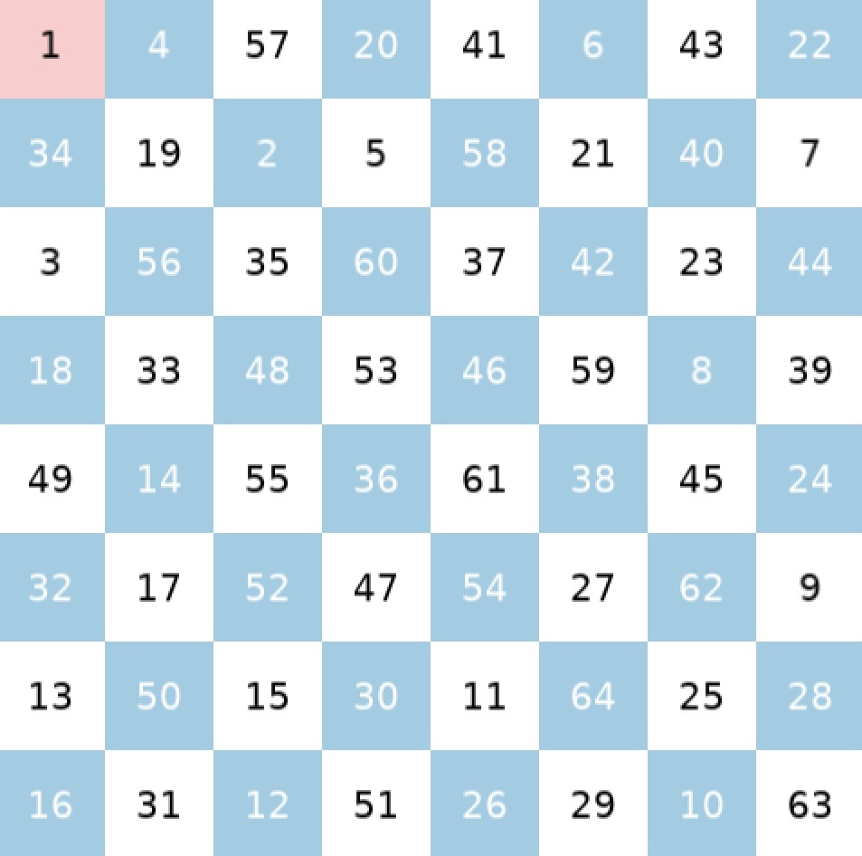
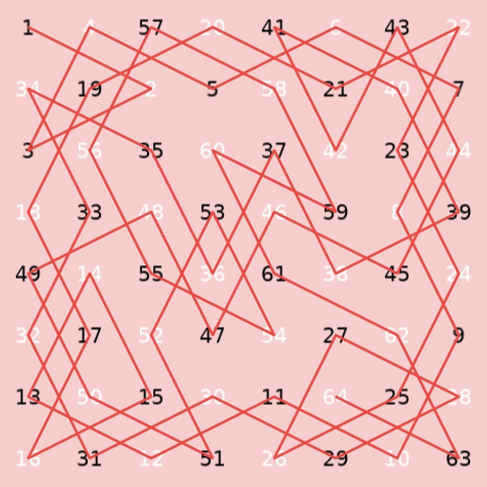

# Knight's Tour Visualization
This project visualizes the Knight's Tour problem, where a knight must visit every square on an 8x8 chessboard exactly once. A knight may only move in an L-shape across the board.

The implementation uses Warnsdorff's algorithm to find a solution and provides an animated visualization of the knight's path.


## Requirements
- LÖVE2D 11.5 or later

## Running the Project
1. Install LÖVE2D from https://love2d.org/
2. Clone this repository
3. Run the game by dragging the project folder onto the LÖVE2D application, or by using the command line: ```love .```

## Directory Structure
```
knights-tour/
├── src/                   
│   ├── knight.lua      # knight's tour algorithm
│   └── board.lua       # board visualization
├── assets/
│   ├── sounds/         # audio files for visualizations
│   ├── images/         # imgs of board before/after the algorithm runs
├── doc/                # remaining to-do's
├── main.lua
├── conf.lua            # pop-up page configurations
├── .gitignore          # ignore editor configs
├── LICENSE
└── README.md
```
